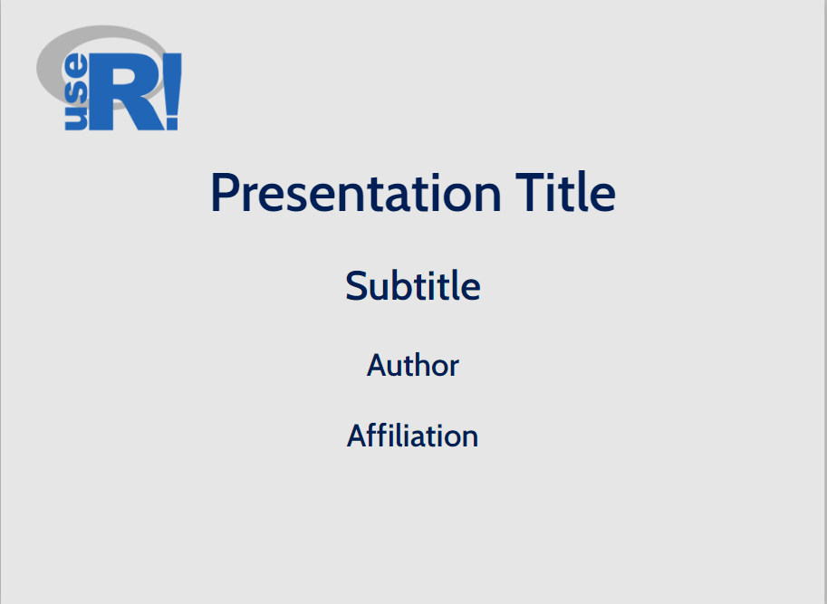
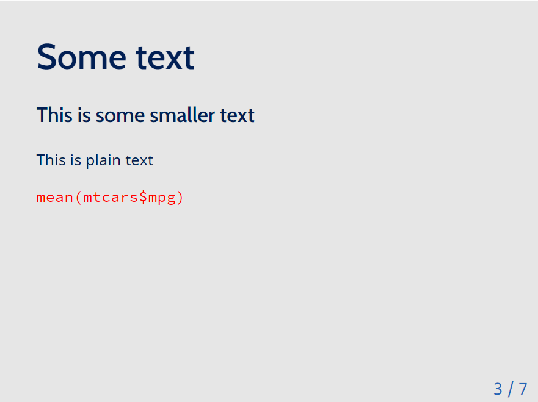
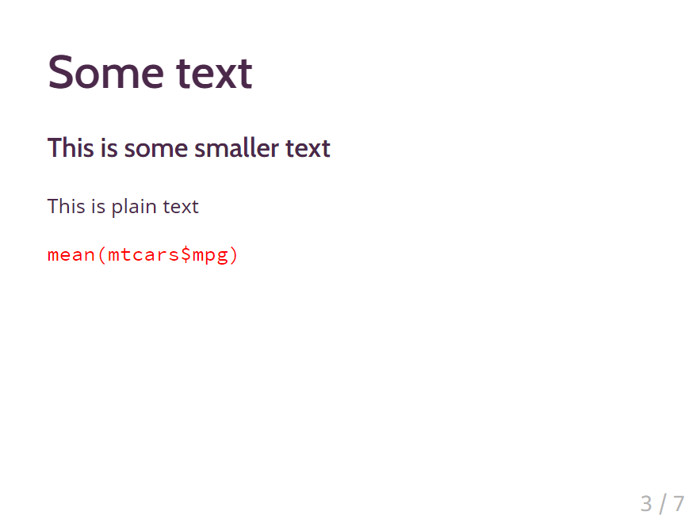

<!-- README.md is generated from README.Rmd. Please edit that file -->

```{r, include = FALSE}
knitr::opts_chunk$set(
  collapse = TRUE,
  comment = "#>"
)
```

# xaringan-template-useR2021

<!-- badges: start -->
<!-- badges: end -->


## ultra_simple_template


```{r, echo=FALSE}



```


```{r, echo=FALSE}



```


## Rladies_template 

```{r, echo=FALSE}

knitr::include_graphics("templates/screenshots/rladies1.png")

```


```{r, echo=FALSE}



```


# beige_template

```{r, echo=FALSE}

knitr::include_graphics("templates/screenshots/beige1.png")


```
```{r, echo=FALSE}

knitr::include_graphics("templates/screenshots/beige2.png")


```

