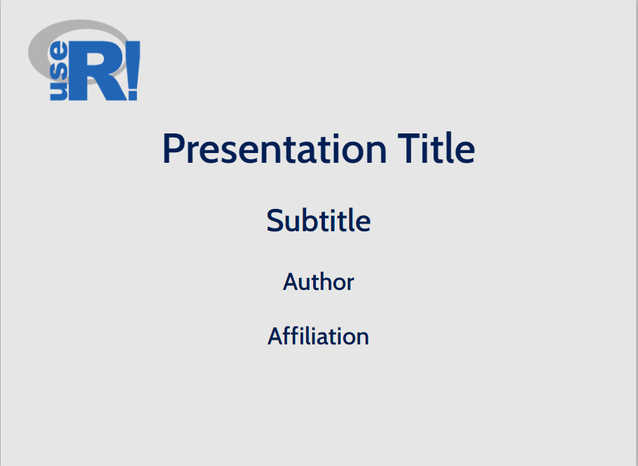
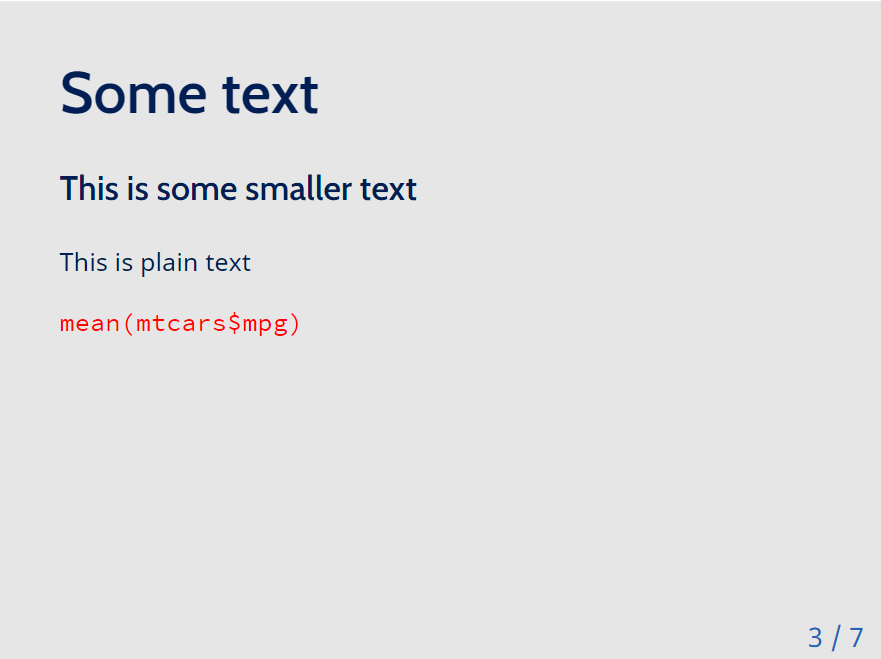
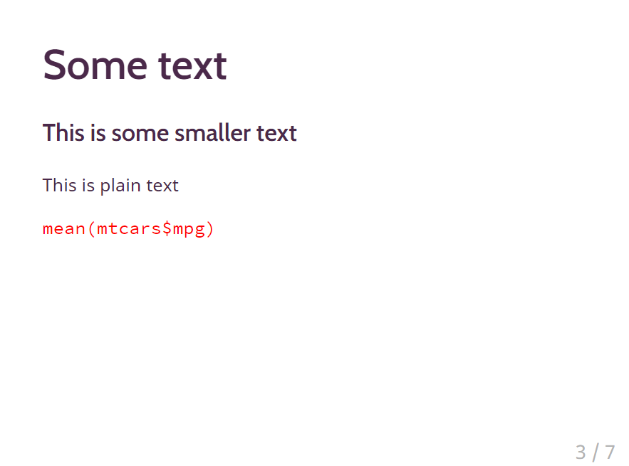
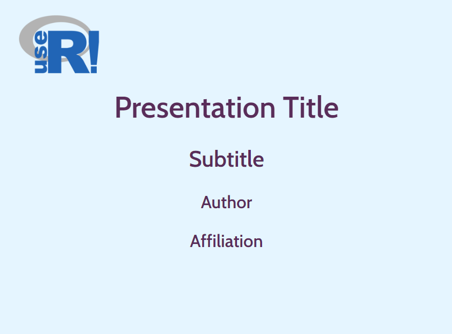
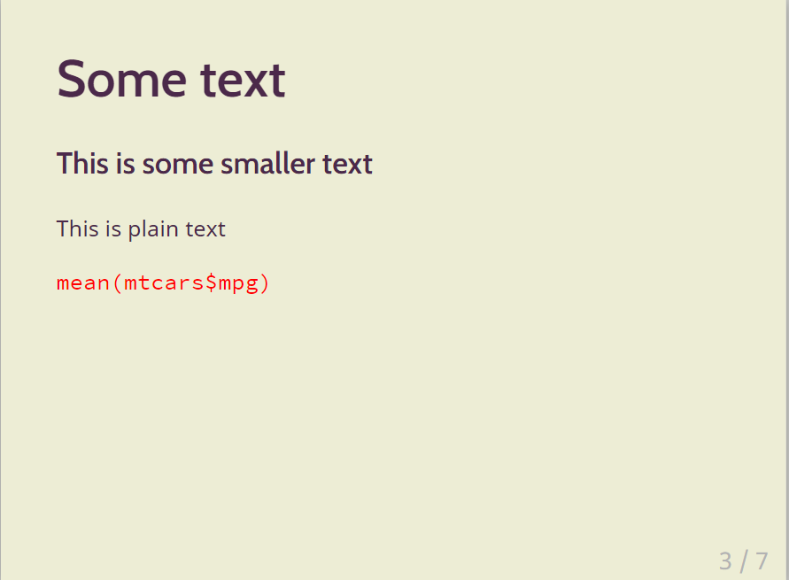

<!-- README.md is generated from README.Rmd. Please edit that file -->

# xaringan-template-useR2021

<!-- badges: start -->

<!-- badges: end -->

## ultra\_simple\_template

## Rladies\_template

# beige\_template

